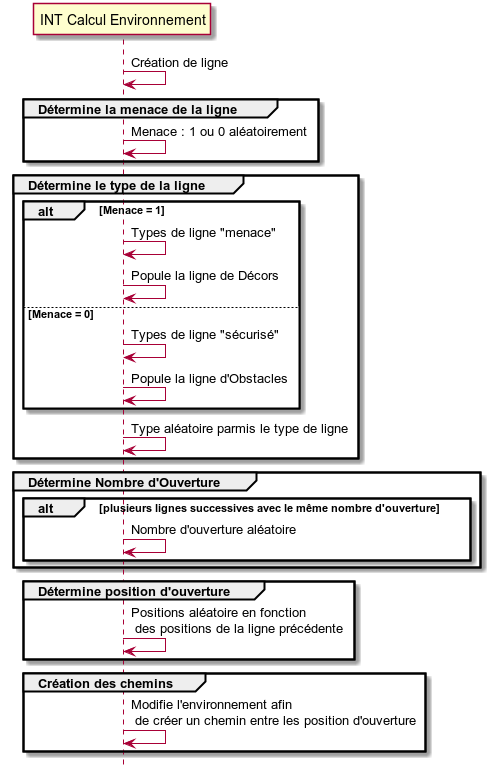

# INT Calcul Environnement #

Ce composant permet de calculer le type d'environnement visible par le joueur.  
On définit un environnement comme étant un tableau deux dimensions. Chaque case représente le type de bloc : (**Décor**, **Obstacle**, ...).  
La première dimension du tableau représente la largeur de l'environnement.  

### Type de bloc ###

Pour chaque case de l'élément, on associe un nombre au type de bloc :
<ul>
	<li> <b>Décor</b> : 0 </li>
	<li> <b>Obstacle</b> : 1</li>
</ul>

### Menace de ligne ###

Chaque ligne de l'environnement est associé à un niveau de menace. Un niveau de menace à 0 implique que la ligne est sans danger pour le joueur et inversement.  

### Type de ligne ###

Chaque ligne de l'environnement est associé à un type. Ce type permet de caractériser le thème de la ligne : 
<ul>
	<li> <b>Route</b></li>
	<li> <b>Eau</b></li>
	<li> <b>Train</b></li>	
	<li> <b>Arbre</b></li>
</ul>

### Nombre d'ouverture ###

Chaque ligne de l'environnement est associé un nombre d'ouverture. Ce nombre détermine le nombre de chemin distinct accessible par le joueur.

### Position des ouvertures ###

Chaque ouverture d'une ligne possède une position. La position des ouvertures doit être comprise dans l'environnement.

## Initialisation ##

### Initialisation de l'environnement ###

L'environnement est initialisé avec ses propres dimensions.  
Les 10 premières lignes sont strictements identiques pour chaques environnement. Elles sont créé via une lecture en mémoire des données de l'environnement.  

## Périmètre ##

### Création d'une ligne ###

La création d'une nouvelle ligne consiste à assigner de manière aléatoire les attributs suivants :

<ul>
	<li> <b>Menace de ligne</b></li>
	<li> <b>Type de ligne</b></li>
	<li> <b>Nombre d'Ouverture</b></li>
	<li> <b>Position d'Ouverture</b></li>
</ul>

### Longueur de l'environnement ###

Afin de limiter le calcul effectué, la longueur de l'environnement est limitée à 50 unités.

### Expérience de Jeu 01 ###
Le **Nombre d'Ouverture** est limité à 2. Il ne peut pas être égal à 0.  
Le **Nombre d'Ouverture** est recalculé après avoir déterminé un certain nombre de ligne.

### Expérience de Jeu 02 ###
Les **Position d'Ouverture** sont calculés en fonction des positions d'ouvertures de la ligne précédente. Elles ne peuvent pas être placées trop loin des position d'ouvertures de la ligne précédente. 
Les **Position d'Ouverture** sont calculés de manière à créer un chemin accessible par le **Joueur**.  