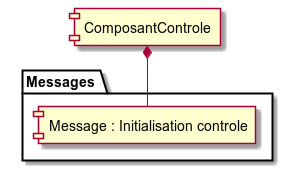
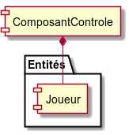
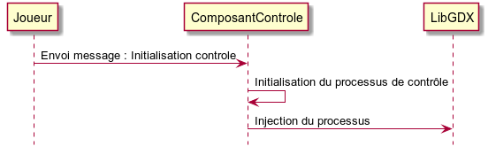
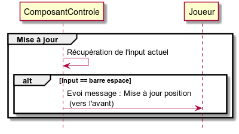

# ComposantControle #

----------

## Messages Associées ##

<table border = "1">
	<tr>
		<th>Message</th>
		<th>Description</th>
	</tr>
	<tr>
		<td>Initialisation controle</td>
		<td>Initialise et met en place le processus de contrôle</td>
	</tr>
</table>

## Entités Associées ##

<table border = "1">
	<tr>
		<th>Entité</th>
		<th>Description</th>
	</tr>
	<tr>
		<td>Joueur</td>
		<td>Modèle de Joueur.</td>
	</tr>
</table>

## Initialisation ##

### Message : Initialisation controle ###

Lorsque **ComposantControle** reçoit un message **Initialisation controle**, le processus de contrôle est mis en place puis injecté dans le contexte LibGDX :

## Mise à jour Composant ##

Lorsque **ComposantControle** est mis à jour, des actions sont déclanchées en fonction de la touche appuyée :

## Périmètre ##