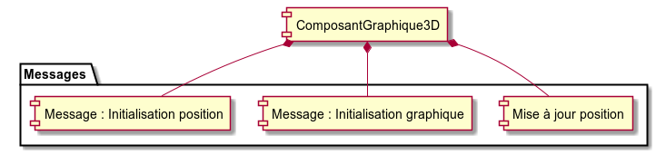
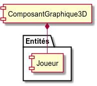
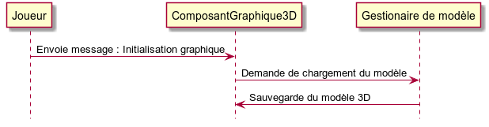
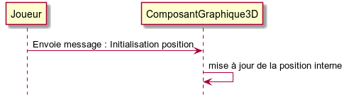
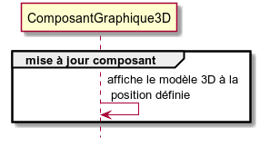
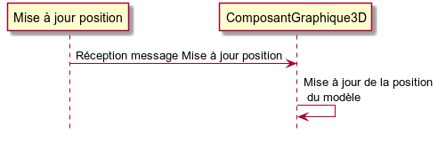

# ComposantGraphique3D #

----------

## Messages Associées ##

<table border = "1">
	<tr>
		<th>Message</th>
		<th>Description</th>
	</tr>
	<tr>
		<td>Mise à jour position</td>
		<td>Met à jour la position du modèle graphique.</td>
	</tr>
	<tr>
		<td>Initialisation graphique</td>
		<td>Sauvegarde le modèle 3D.</td>
	</tr>
	<tr>
		<td>Initialisation position</td>
		<td>Initialise la position du modèle.</td>
	</tr>
</table>

## Entités Associées ##

<table border = "1">
	<tr>
		<th>Entité</th>
		<th>Description</th>
	</tr>
	<tr>
		<td>Joueur</td>
		<td>Modèle graphique du Joueur.</td>
	</tr>
</table>

## Initialisation ##

### Message : Initialisation graphique ###

Lorsque le **ComposantGraphique3D** reçoit un message d'initialisation graphique, le modèle est chargé puis stocké en mémoire dans le composant :

### Message : Initialisation Position ###

Lorsque le **ComposantGraphique3D** reçoit un message d'initialisation position :

## Mise à jour Composant ##

Lorsque **ComposantGraphique3D** est mis à jour, le modèle 3D est déssiné à la position définie :

## Périmètre ##

Le **ComposantGraphique3D** est un composant générique permettant d'afficher un modèle 3D. La position du composant est gérée par le message **Mise à jour position**.

### Mise à jour position ###

Lors de la réception du message **Mise à jour position** : 

