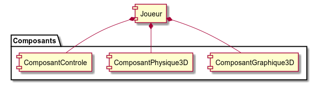
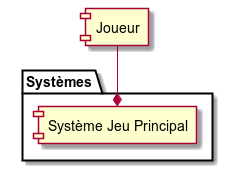
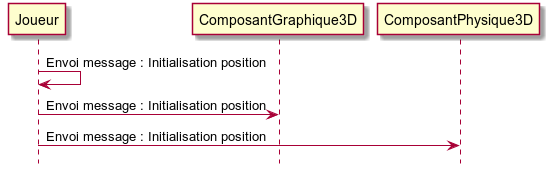
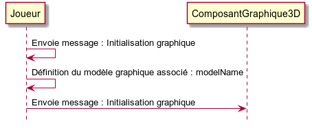
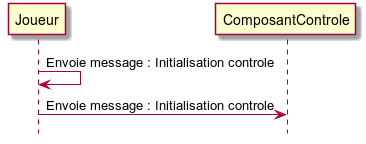
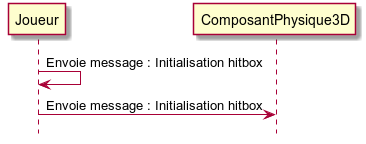
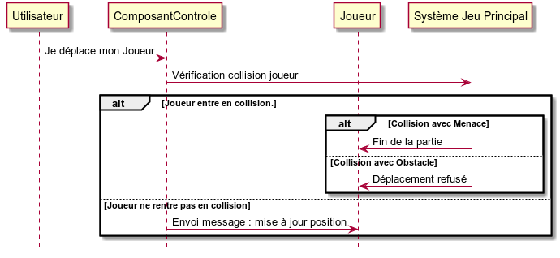
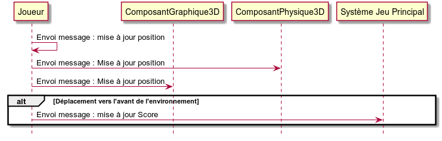

# Joueur #

----------

## Composants Associées ##

<table border = "1">
	<tr>
		<th>Composant</th>
		<th>Cardinalité</th>
		<th>Description</th>
	</tr>
	<tr>
		<td>ComposantGraphique3D</td>
		<td>1</td>
		<td>Modèle graphique du joueur.</td>
	</tr>
	<tr>
		<td>ComposantPhysique3D</td>
		<td>1</td>
		<td>Donne au joueur la capacité de bouger.</td>
	</tr>
	<tr>
		<td>ComposantControle</td>
		<td>1</td>
		<td>Donne au joueur la capacité d'être contrôlé.</td>
	</tr>
</table>

## Systèmes composant ##

<table border = "1">
	<tr>
		<th>Système</th>
		<th>Description</th>
	</tr>
	<tr>
		<td>Système Jeu Principal</td>
		<td>Environnement de jeu.</td>
	</tr>
</table>

## Initialisation ##

### Message : Initialisation position ###

Lorsque le **Joueur** reçoit un message d'initialisation de position, le message est directement transmis : 

### Message : Initialisation graphique ###

Lorsque le **Joueur** reçoit un message d'initialisation graphique, le message est transmis en fonction du modèle associé : 

### Message : Initialisation contrôle ###

Lorsque le **Joueur** reçoit un message d'initialisation de contrôle, le message est directement transmis :

### Message : Initialisation hitbox ###

Lorsque le **Joueur** reçoit un message d'initialisation de hitbox, le message est directement transmis :

## Périmètre ##

Le **Joueur** peut se déplacer dans son environnement grâce à son **ComposantPhysique3D**. Il est représenté graphiquement par **ComposantGraphique3D**. Il est contrôlé par l'utilisateur grâce à **ComposantControle**.

### Déplacement ###

Le déplacement du joueur vers une direction quelconque de son environnement est effectué de la manière suivante :

### Message : Mise à jour position ###

Lorsque le **Joueur** reçoit un message de mise à jour de sa position. La mise à jour de sa position n'est pas instantanée, elle est conditionnée par la vitesse de déplacement du **Joueur** :

