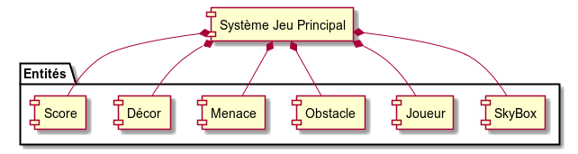
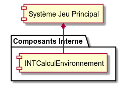
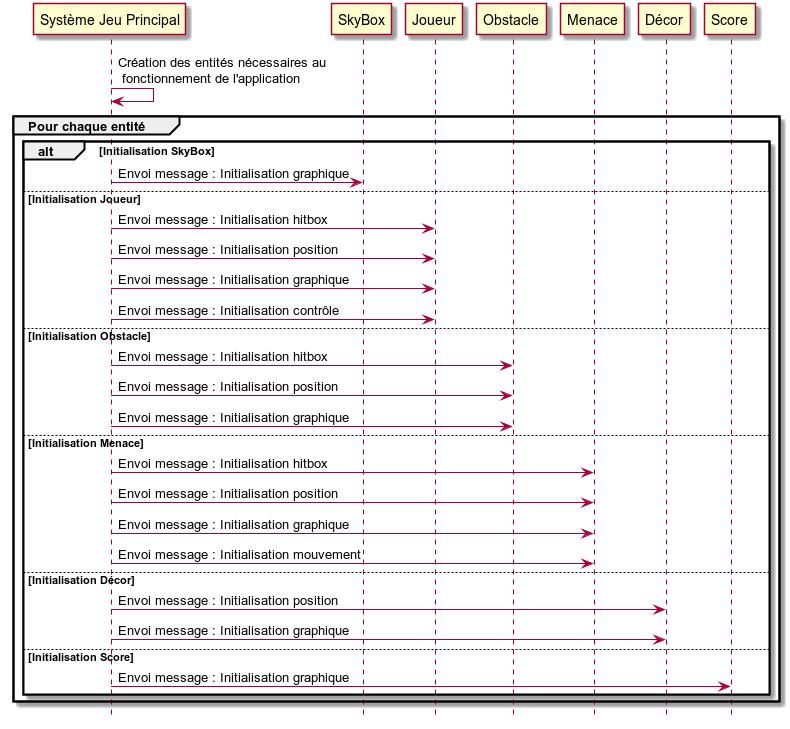
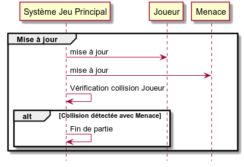
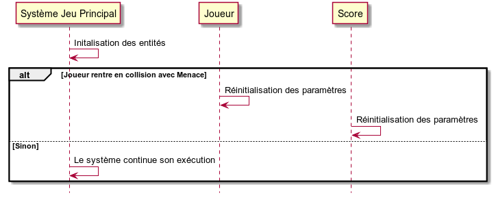
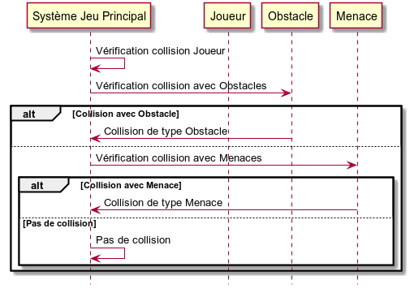

# Système Jeu Principal #

----------

## Entités Associées ##

<table border = "1">
	<tr>
		<th>Entité</th>
		<th>Cardinalité</th>
		<th>Description</th>
	</tr>
	<tr>
		<td>SkyBox</td>
		<td>1</td>
		<td>Environnement graphique extérieur</td>
	</tr>
	<tr>
		<td>Joueur</td>
		<td>1</td>
		<td>Personnage jouable</td>
	</tr>
	<tr>
		<td>Obstacle</td>
		<td>0..*</td>
		<td>Tout type d'obstacle.   Ne peut pas être traversé par le joueur.</td>
	</tr>
	<tr>
		<td>Menace</td>
		<td>0..*</td>
		<td>Tout type d'obstacle malveillant.   Intéraction d'échec avec le joueur.</td>
	</tr>
	<tr>
		<td>Décor</td>
		<td>0..*</td>
		<td>Décor pouvant être traversé par le Joueur</td>
	</tr>
	<tr>
		<td>Score</td>
		<td>1</td>
		<td>Détermine le score actuel du joueur.</td>
	</tr>
</table>

## Composants Interne ##

<table border = "1">
	<tr>
		<th>Composant</th>
		<th>Description</th>
	</tr>
	<tr>
		<td>INTCalculEnvironnement</td>
		<td>Composant permettant de calculer l'environnement de jeu.</td>
	</tr>
</table>

## Initialisation ##

L'initialisation du **Système Jeu Principal** consiste à créer les entités nécessaires ainsi que de les initialiser :

## Mise à jour Système ##

Lorsque **Système Jeu Principal** est mis à jour, nous appellons le service interne de **Vérification collision Joueur**. Si un collision est observée avec une **Menace**, la partie actuelle est terminée.

## Périmètre ##

Le **Système Jeu Principal** représente la vue principale de l'application. C'est dans ce système où le **Joueur** se déplace et rentre en collision avec les **Obstacles** ou **Menaces**.  
Lorsque le **Joueur** parvient à se déplacer vers l'avant, le **Score** est mis à jour.

Une collision avec des menances implique une fin de partie.  

### Fin de partie ###

Lorsque le **Joueur** rentre en collision avec une **Menace**, la partie prend fin. L'entité **Joueur** est réinitialisé.  

### Vérification collision Joueur ###

Le système vérifie si le **Joueur** rentre en collision avec **Obstacle** ou **Menace** : 

