# INT Calcul Environnement #

Ce composant permet de calculer le type d'environnement visible par le joueur.  

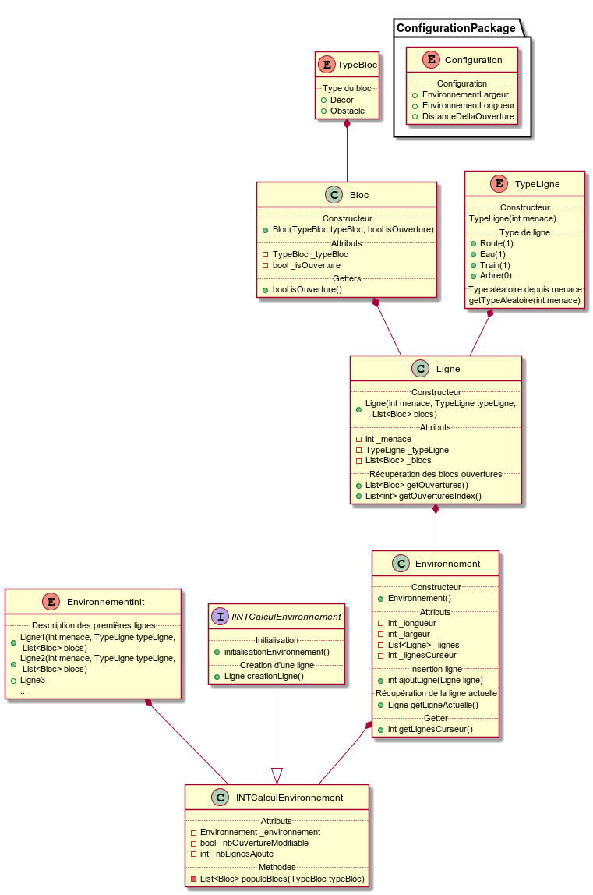

## Configuration ##

Cette classe permet de sotcker toutes les informations de configuration :
<UL>
	<li>EnvironnementLargeur : la largeur de l'environnement</li>
	<li>EnvironnementLongueur : la longueur de l'environnement</li>
	<li>DistanceDeltaOuverture : le delta de distance maximum de placement des ouvertures d'une ligne</li>
</UL>

## IINTCalculEnvironnement ##

Interface exposant les méthodes de calculs nécessaire à la mise à jour de l'environnement.

## INTCalculEnvironnement ##

Implémentation de IINTCalculEnvironnement. C'est ici où la la logique de mise à jour de l'nevironnement est présente.

### Initialisation ###
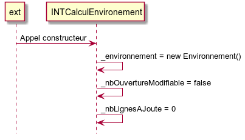

### initialisationEnvironnement() ###
Initialise l'attribut _environnement.
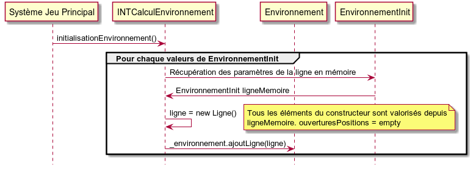

### creationLigne() ###
Créé une nouvelle ligne à l'environnement.

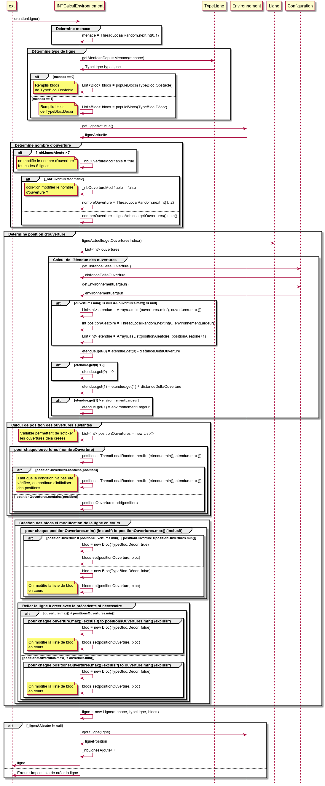

## Environnement ##
Cette classe représente de manière schématique l'environnement global du jeu.

### Initialisation ###
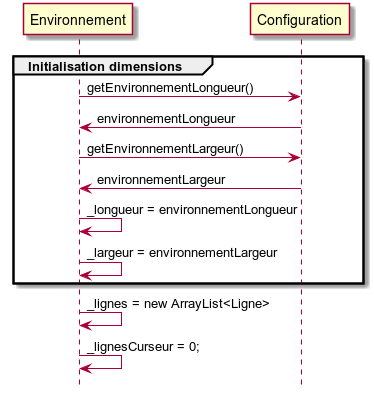

### ajoutLigne(Ligne) ###
Ajoute une ligne vers l'attribute _lignes.
Met à jour le curseur d'insertion de ligne.
Retourne le dernier index inséré.

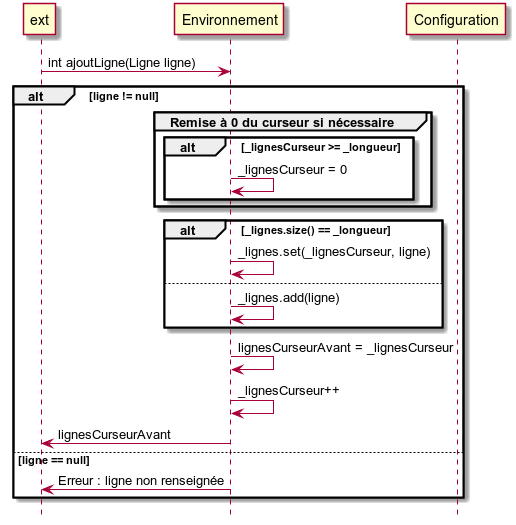

### getLigneActuelle() ###
Retourne la ligne actulle indiquée par le pointeur. 
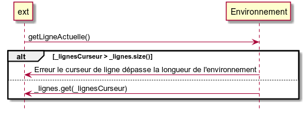

### populeBlocs(List<Blocs> blocs, TypeBloc typeBloc) ###
Remplis la liste blocs de blocs associés au type typeBloc. Le nombre d'élements dépend de la largeur de l'environnement de configuration.  
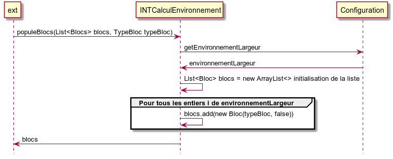

## Ligne ##
Cette classe représente de manière schématique une ligne du jeu.

### Initialisation ###
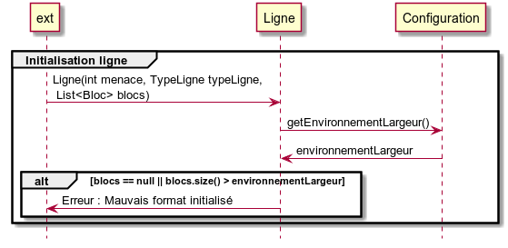

### getOuvertures ###
Retourne les blocs d'ouvertures de la ligne.  
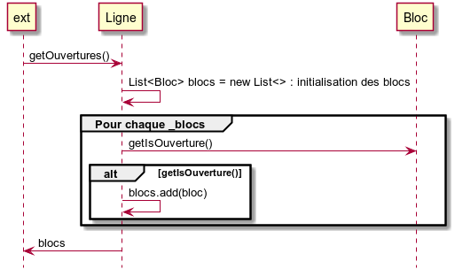

### getOuverturesIndex ###
Retourve les positions des ouvertures.  
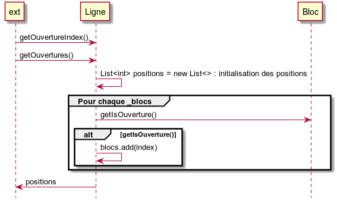

## TypeLigne ##
Cette énumération permet de préciser le type de la ligne. Ce type sera ensuite utilisé pour l'affichage graphique.

### getTypeAleatoire(int menace) ###
Retourne un type aléatoire suivant la menace renseingée.
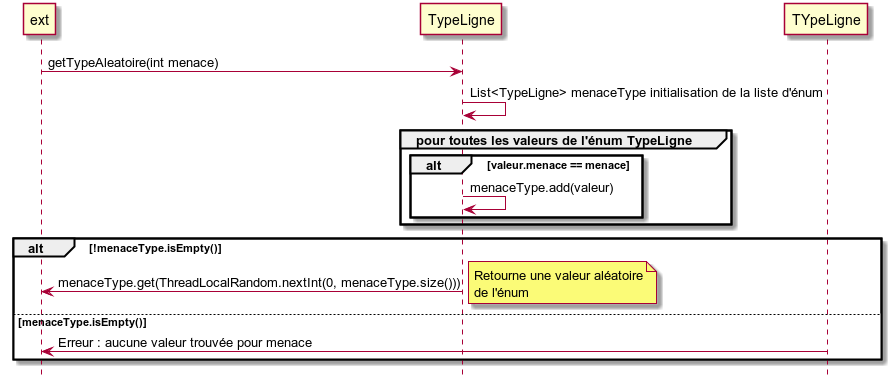